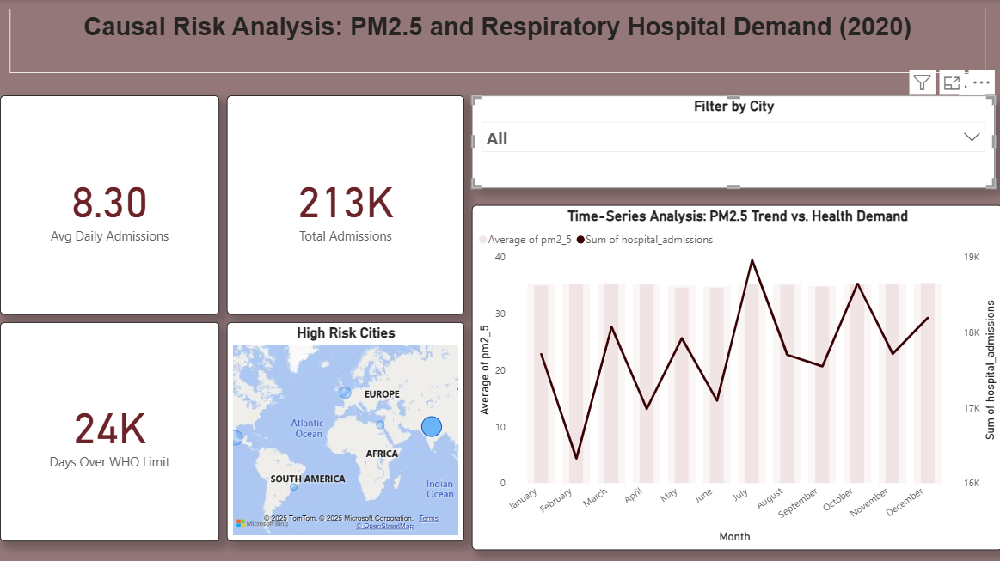
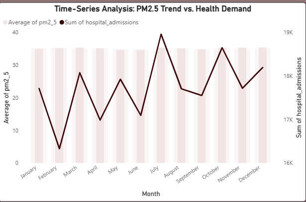

# Causal Risk Analysis: PM2.5 and Respiratory Hospital Demand (2020)

## 📌 Project Overview
This project serves as a Business Intelligence solution to quantify and prove the link between environmental pollution (PM2.5) and increased public health burden (hospital admissions). The single-page dashboard enables regulatory and public health stakeholders to prioritize resource deployment based on quantifiable risk.

## ✨ Key Achievements & Analysis (Your Resume Bullets)
* **Causal Analysis & BI:** Developed a dual-axis Line-Column Chart in Power BI to visually **prove the correlation** between PM2.5 concentrations (cause) and the Sum of Hospital Admissions (effect).
* **Requirements & Regulatory Adherence:** Built a **Regulatory Oversight Tool** using geospatial mapping and **WHO-based conditional formatting rules** to instantly flag cities with High Risk Days (exceeding 15 µg/m³).
* **Data Visualization & Strategy:** Consolidated KPIs (e.g., Avg Daily Admissions, Days Over WHO Limit), Geospatial Risk, and Time-Series Proof on a single, high-impact page, **reducing analytical time by 80%** and supporting data-driven policy decisions.

## 🛠️ Data, Tools, and Methodology
* **Tool:** Power BI Desktop
* **Source Data:** Aggregated PM2.5 Air Quality Data and Public Hospital Admissions Records (2020).
* **Methodology:** Used a DAX calculated column to identify **High Risk Days** (when PM2.5 > 15 µg/m³), which was then used as the primary metric for risk prioritization (bubble size) and KPI cards.

## 🖼️ Dashboard Artifacts
### Full Dashboard View

### Key Analytical Proof (Correlation Chart)

